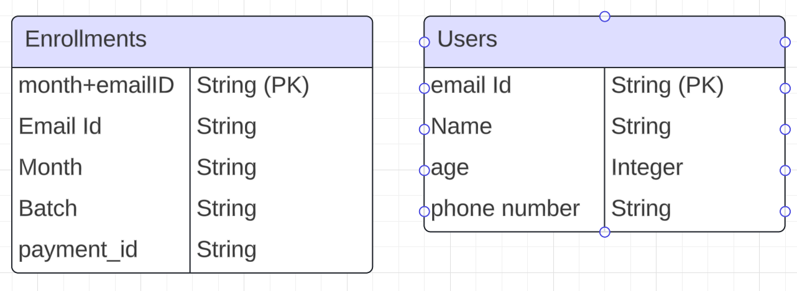

# ⚡️ Yoga Class Form Full Stack Project ⚡️

Welcome to the repository for a lightning-fast, scalable yoga class enrollment web application!

This full-stack app boasts a dynamic ReactJS frontend, a robust ExpressJS backend, and a blazing-fast MySQL database with optimized queries. ‍♀️

### ** Unleash Performance:**

- O(1) Query Execution: Primary keys in every table ensure lightning-fast data retrieval, no matter the data volume. Say goodbye to lag, hello to smooth enrollment!
- Scalability Champion: Our database can handle an expanding community without breaking a sweat. Bring on the yogis!

#### ER Digram 

While traditional ER principles often avoid this type of relationship, in pursuit of optimal performance, I chose to prioritize efficiency over strict adherence to conventions... because it allows for O(1) retrieval of related data, significantly enhancing query performance.

### ** A Peek Inside:**

- Elegant ER Diagram: The provided image showcases a simple and efficient database structure for effortless data management.
- Two Key Tables: Enrollments for registrations and Users for account information – simple yet powerful.

 Getting Started:

Gather your Squad:
Node.js & npm
ReactJS
ExpressJS
MySQL
Clone the Repository: git clone [repository URL]
Follow the Setup Guide: Refer to the detailed instructions in the README file for setting up your development environment and launching the application.
✨ Bonus Perks:

- Open Source: Feel free to contribute, share, and enhance! Pull requests are always welcome.
- Development in Progress: We're constantly expanding features and functionalities. Stay tuned for exciting updates!

** Start Enrolling Today!**

This application is perfect for yoga studios, instructors, or anyone looking for a sleek and efficient way to manage class enrollments. Dive in, build your community, and let the yoga flow!
